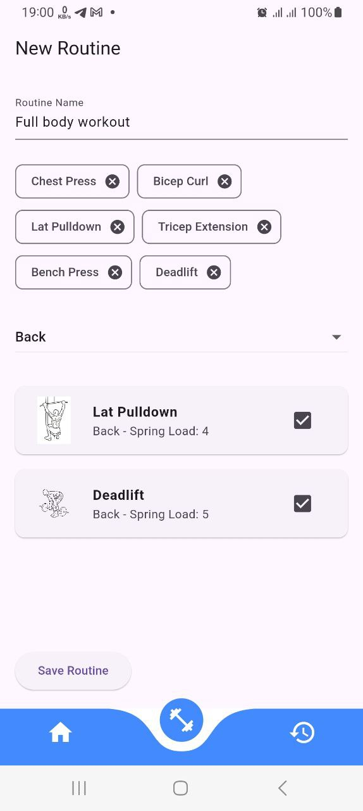
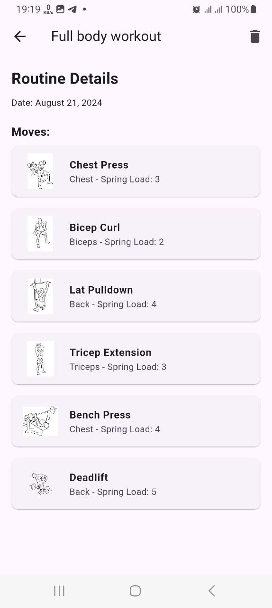

# Fitness Routine Builder App

This is a concept app built using Flutter and GetX for managing and creating custom fitness routines. This app is intended as a demonstration of concepts and is not a production-ready application.

## Screenshots

### New Routine Screen


### Routine Detail Screen


## Getting Started

To run this app locally, follow these steps:

### Prerequisites

- Flutter SDK
- Dart SDK
- A code editor like Visual Studio Code or Android Studio

### Installation

1. Clone the repository:
   ```bash
   git clone https://github.com/ETdvlpr/Fitness-Routine-Builder.git
   cd Fitness-Routine-Builder
   ```

2. Install the dependencies:
   ```bash
   flutter pub get
   ```

3. Run the app:
   ```bash
   flutter run
   ```

## Dependencies

This project uses the following key dependencies:

- `get`: State management solution for managing app state.
- `curved_navigation_bar`: For the animated bottom navigation bar.
- `cached_network_image`: For loading and caching images from URLs.

## Disclaimer

This is a **concept app** and is not intended for production use. The purpose of this app is to demonstrate the building blocks for a fitness routine builder app.